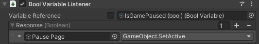
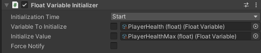
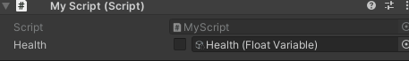
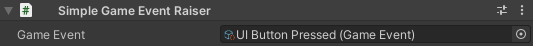

# 📖 ScriptableObject Architecture 📖

This repository contains scripts that can help creating/using a Game Architecture centered around the ScriptableObjects
which can "saves us(developers) pain".
- [Variable ScriptableObject](#-variable-scriptableobject)
- [GameEvent ScriptableObject](#-gameevent-scriptableobject)
- *More to come here...*

If you want to know more about the advantages of a such architecture, I recommend you watching these two Unite talks:
- [Overthrowing MonoBehaviour Tyranny - Unite 2016](https://www.youtube.com/watch?v=6vmRwLYWNRo)
- [Game Architecture with Scriptable Objects - Unite 2017](https://www.youtube.com/watch?v=raQ3iHhE_Kk)

This repository is in it's first state and could largely be modified/improved after more usages in real development.

---
## 🔵 IMPORTING
Import as a package in the Unity Package Manager with the git link 
(cf [link to it from github directly](https://docs.unity3d.com/Manual/upm-ui-giturl.html))
`https://github.com/outfoxeed/scriptableobject-architecure.git`

---
## 🔵 SCRIPTABLE OBJECTS CENTERED ARCHITECTURE

### ⚪ Variable ScriptableObject
Generic ReadOnly and ReadWrite value stored in a scriptable object.
Allows a subscription to the changes of the value inside of the ScriptableObject.

The inspector shows indications on the usage of the Variable ScriptableObject
- Debug Mode (only present in UnityEditor) -> Logs every subscription on the scriptable object and gives the subscriber
- Description (only present in UnityEditor) -> Only for a better comprehension of the ScriptableObject utility
- Value -> the actual value represented by the ScriptableObject. It is perfectly editable during playtime and will notify the subscribers of the change.
- Subscriptions Dictionary (only present during Playtime in UnityEditor) -> Shows precise details on who is subscribed to the Variable changes and for what.


Comes with VariableListeners and VariableInitializers MonoBehaviour classes



### ⚪ Variable Reference (Type)
Generic type allowing a script to use a Variable scriptable object or a custom value
without changing the code. 

Useful for creating an exception for the creation of specific cases or debugging. 



### ⚪ GameEvent ScriptableObject
It acts as an event which we can subscribe to and raise if wanted. The ScriptableObject can be given as ReadOnly to not allow the raise of the GameEvent.
These events can also have a parameter.  

The inspector shows indications on the usage of the GameEvent ScriptableObject
- Debug Mode (only present in UnityEditor) -> Logs every subscription on the scriptable object and gives the subscriber
- Description (only present in UnityEditor) -> Only for a better comprehension of the ScriptableObject utility
- Subscriptions Dictionary (only present during Playtime in UnityEditor) -> Shows precise details on who is subscribed to the Variable changes and for what.


Comes with GameEventListeners and GameEventRaiser MonoBehaviour classes



---
## 🔵 Concepts
### ⚪ Subscriptions
A subscription is an object representing: a subscription name, an owner (aka subscriber) 
and a callback(System.Action) taking into account the value of the object it is subscribed to.

#### Callback invocation time
When subscribing to an object, the object will ensure the callback given on the subscription 
is getting called whenever 
- it's value changes for [Variables](#-variable-scriptableobject). 
- the event is getting raised for [GameEvents](#-gameevent-scriptableobject)


#### Stop a subscription
When subscribing to a GameEvent or Variable, it returns a IDisposable object. When we want to stop/cancel the subscription we can just call the Dispose method on the IDisposable object.
The subscription will then not be called when the value of the object we originally subscribed to changes.

#### Example of the subscription done in the GameEventListener generic class
```
public class GameEventListener<T> : MonoBehaviour, IGameEventListener<T>
{
    [SerializeField] private string _responseName;
    [SerializeField] private GameEvent<T> _gameEvent;
    [SerializeField] private UnityEvent<T> _response;
    private IDisposable _disposable;
    
    protected virtual void OnEnable()
    {
        _disposable?.Dispose();
        
        // We subscribe here giving the callback 
        // we want being triggered when the event is getting raised 
        _disposable = _gameEvent.Subscribe(this, _responseName, parameter => _response.Invoke(parameter));
    }
    protected virtual void OnDisable()
    {
        // We dispose our subscription -> our callback will no more be called
        _disposable?.Dispose();
        _disposable = null;
    }
}
```

---
## 🔵 FUTURE
TODO:
- Runtime Sets ScriptableObjects (ScriptableObject containing a collection of objects)

In Development:
- NaN. Need to test the usage of this package for a better declaration of the goals to meet.
