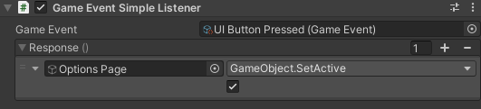

# 📖 ScriptableObject Architecture 📖
## Introduction

This repository contains scripts that can help creating/using a Game Architecture centered around the ScriptableObjects
which can "saves us(developers) pain".
- [Variable ScriptableObject](#-variable-scriptableobject)
- [GameEvent ScriptableObject](#-gameevent-scriptableobject)
- [RuntimeSet(List) ScriptableObject](#-runtimeset-scriptableobject)
- [Constant ScriptableObject](#-constant-scriptableobject)

<br/>If you want to know more about the advantages of a such architecture, I recommend you watching these two Unite talks:
- [Game Architecture with Scriptable Objects - Unite 2017](https://www.youtube.com/watch?v=raQ3iHhE_Kk)
- [Overthrowing MonoBehaviour Tyranny - Unite 2016](https://www.youtube.com/watch?v=6vmRwLYWNRo)

<br/>This repository is **in development** and is *irregularly* modified/improved after more uses of this package in real game development.

## Mentions
This repository is heavily inspired from other packages offering similar features:
- Unity Atoms ([Github](https://github.com/unity-atoms/unity-atoms))
- Daniel Everland's ScriptableObject Architecture([Github](https://github.com/DanielEverland/ScriptableObject-Architecture) / [Unity Asset Store](https://assetstore.unity.com/packages/tools/utilities/scriptableobject-architecture-131520))
- Generic Scriptable Architecture ([Github](https://github.com/SolidAlloy/GenericScriptableArchitecture))

---
## 🔵 SUMMARY
1. [Importing](#-importing)
2. [Scriptable Object Centered Architecture](#-scriptable-objects-centered-architecture)
    - [Variable SO](#-variable-scriptableobject)
    - [Reference](#-reference-type)
    - [GameEvent SO](#-gameevent-scriptableobject)
    - [RuntimeSet SO](#-runtimeset-scriptableobject)
    - [Constant SO](#-constant-scriptableobject)
    - [Instancers](#-instancers)
3. [Code Generation](#-code-generation)
4. [Concepts](#-concepts)
    - [Subscriptions](#-subscriptions)
5. [Future](#-future)

---
## 🔵 IMPORTING
### Dependencies
You need to have these dependencies in your project to use this package:
- UniRx ([Github](https://github.com/neuecc/UniRx) / [Unity Asset Store](https://assetstore.unity.com/packages/tools/integration/unirx-reactive-extensions-for-unity-17276))
### Import with Git
Import as a package in the Unity Package Manager with the git link 
(cf [link to it from github directly](https://docs.unity3d.com/Manual/upm-ui-giturl.html))
`https://github.com/outfoxeed/scriptableobject-architecure.git`

### Download and drop into project
Download the zip of this git repository on this page or [here](https://github.com/Outfoxeed/ScriptableObject-Architecture/archive/refs/heads/main.zip) and unzip it wherever you want in your Assets folder

---
## 🔵 SCRIPTABLE OBJECTS CENTERED ARCHITECTURE
Every ScriptableObject mentioned below have these two parameters only available in UnityEditor:
- Debug Mode -> If true, the ScriptableObject logs every new subscription and value changes
- Description -> Text to explain to the dev team the usage of this ScriptableObject 

### ⚪ Variable (ScriptableObject)
Value stored in a scriptable object.
Allows a subscription to the changes of the value inside of the ScriptableObject.
<br/>
Each VariableSO has a ReadOnly and a ReadWrite version


Fields available in the Inpector of a Variable:
- Value -> the actual value represented by the ScriptableObject. It is perfectly editable during playtime and will notify the subscribers of the change.
- Default Value -> which value to set when resetting the Value of the ScriptableObject

### ⚪ Reference (Type)
Generic type allowing a script to use a [Variable SO](#⚪-variable-scriptableobject) or a custom value or a [Constant](#⚪-constant-scriptableobject) or a [VariableInstancer](#⚪-instancers) without changing the code. 
Useful for creating an exception for the creation of specific cases or debugging.
<br/>
There is also ReadOnlyReference version.


#### Reference Listeners
Using this new type. These components allow to easily attach a UnityEvent to a Reference value 
<br/>


#### Reference Setters
These components sets the value of a Reference to the value of another when wanted (Awake, OnEnabled, OnStart, Never)
<br/>
The method doing the actual work is also accessible from UnityEvents.
<br/>


### ⚪ GameEvent (ScriptableObject)
It acts as an event which we can subscribe to and raise if wanted. The ScriptableObject can be given as ReadOnly, not allowing the raise of the GameEvent.
These events can also have a parameter.  


During playtime in Editor, a button "Debug Raise" appears on the ScriptableObject inspector. Allowing you to raise the event for debugging.

#### GameEvent Listeners
These components allow to easily attach a UnityEvent to a GameEvent
<br/>


### ⚪ RuntimeSet (ScriptableObject)
ScriptableObject containing a list of data. 
<br/>The ReadOnly version allows to subscribe to the events of the runtime set. <br/>The ReadWrite offers also the possibilty of using the RuntimeSet as a standard C# list (Add/Remove/etc...)

<br/>Available subscriptions :
- Element Added
- Element Removed
- Element Changed
- List Count Changed

#### Example of a subscription on the CountChanged event
```
public class RuntimeSetSubscriptionExample : MonoBehaviour
{
    [SerializeField] private RuntimeSet<int> _runtimeSet;
    private IDisposable _disposable;

    private void OnEnable()
    {
        _disposable = _runtimeSet.ObserveCountChanged().Subscribe(OnCountChanged);
    }

    private void OnDisable()
    {
        _disposable?.Dispose();
        _disposable = null;
    }

    private void OnCountChanged(CountChangedEvent countChangedEvent)
    {
        Debug.Log($"Old Count: {countChangedEvent.OldCount} // New Count: {countChangedEvent.NewCount}");
    }
}
```

### ⚪ Constant (ScriptableObject)
Value stored in a scriptable object. Ensure the value is not editable at runtime.
<br/>
A Constant is Read Only.

### ⚪ Instancers
This repo contains VariableInstancers for each type of Variable and of GameEvent.
These MonoBehaviour classes instantiate a new ScriptableObject on Awake.

The instantiated Variable can be used through the Instancer and References.
<br/>
When playing in Editor, you can see the instantiated SO's detail in the inspector of the Instancer. 

---
## 🔵 Code Generation
This package contains a simple window allowing you to generate the scripts needed for the [Variables](#⚪-variable-scriptableobject)/[GameEvents](#⚪-gameevent-scriptableobject)/[Constants](#⚪-constant-scriptableobject)/[RuntimeSets](#⚪-runtimeset-scriptableobject)/etc... as well as the different Listeners/Setters/Injectors/etc... with a wanted type.

The window is openable from the MenuItem "SO Arch/Code Generation".


#### Example
If you have a script Player and you want to create Variable using your Player type. You can open the Code Generation Window, type the name 'Player' into the "Target Type Name" field. 
<br/>Hit the 'Generate' button and all the scripts are getting generated into a folder in the Assets. 

If your script is contained inside a namespace, precise the namespace name (ex: 'MyGameNamespace.Player' where 'MyGameNamespace' is the name of the namespace in which 'Player' is contained) 

---
## 🔵 Concepts
### ⚪ Subscriptions
A subscription is an object representing: a subscription name, an owner (aka subscriber) 
and a callback(System.Action) taking into account the value of the object it is subscribed to.

#### Callback invocation time
When subscribing to an object, the object will ensure the callback given on the subscription 
is getting called whenever 
- it's value changes for [Variables](#-variable-scriptableobject). 
- the event is getting raised for [GameEvents](#-gameevent-scriptableobject)

#### Stop a subscription
When subscribing to a IObservable(ex: GameEvent, Variable, etc...), it returns a IDisposable object. When we want to stop/cancel the subscription we can just call the Dispose method on the IDisposable object.
<br/>
The callback we gave when subscribing won't be called anymore.

#### Example of the subscription done in the GameEventListener generic class
```
public class GameEventListener<T> : MonoBehaviour, IGameEventListener<T>
{
    [SerializeField] private ReadOnlyGameEvent<T> _gameEvent;
    [SerializeField] private UnityEvent<T> _response;
    private IDisposable _disposable;
    
    protected virtual void OnEnable()
    {
        _disposable?.Dispose();

        /* We subscribe here giving the callback 
        we want being triggered when the event is getting raised */ 
        _disposable = _gameEvent.Subscribe(_response.Invoke);
    }
    protected virtual void OnDisable()
    {
        // We dispose our subscription -> our callback won't be called anymore
        _disposable?.Dispose();
        _disposable = null;
    }
}
```

---
## 🔵 FUTURE
TODO:
- RuntimeSetInjector (MonoBehaviour) -> Add reference to wanted runtime set OnEnable and remove it OnDisable
- RuntimeSetListener (MonoBheaviour) -> Allow to easily attach a UnityEvent on one of the event of the RuntimeSet
- GameEventInstancer (MonoBehaviour) -> Creates an instance of a GameEvent ScriptableObject
